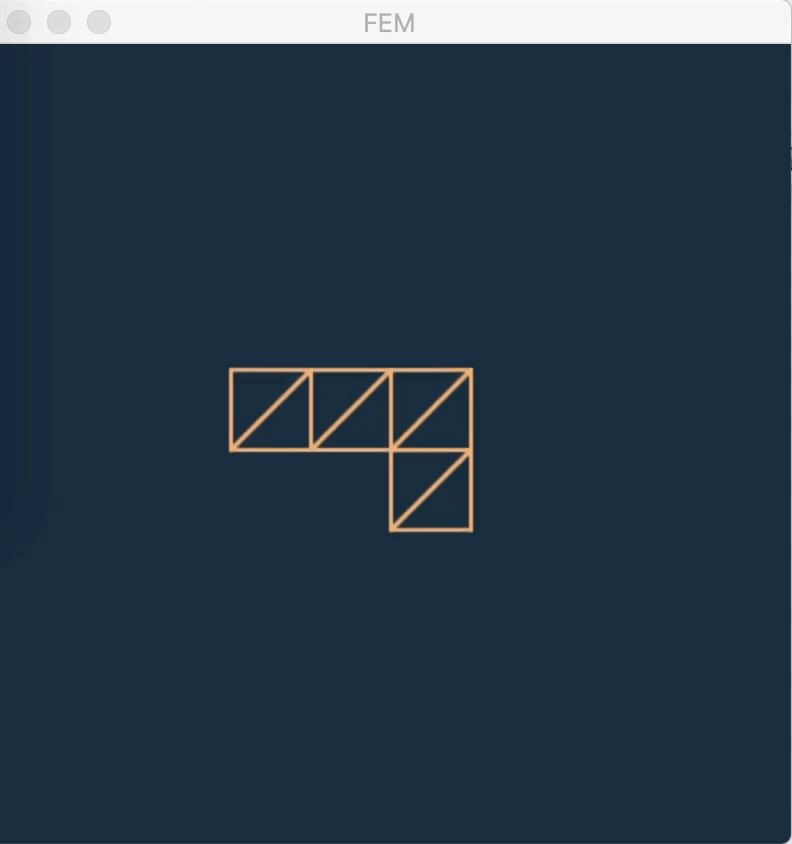

# GAMES-201-Advanced-Physics-Engines

## Course Information

**Course Name:** GAMES 201 Advanced Physics Engines

**Instructor:** [Yuanming Hu](http://taichi.graphics/me/), MIT

Course Videos: [https://www.bilibili.com/video/BV1ZK411H7Hc](https://www.bilibili.com/video/BV1ZK411H7Hc)  
Course BBS: [https://forum.taichi.graphics](https://forum.taichi.graphics)  

The course aims to provide foundation of simulation with implementation of [Taichi Programing Language](https://github.com/taichi-dev/taichi). Content includes: SPH, FEM, MPM, Lagrangian and Eulerian approach.

## SPH
  
Reference:  
Becker, Markus, and Matthias Teschner. "Weakly compressible SPH for free surface flows."  

## FEM
  
Reference:  
[https://www.comsol.com/multiphysics/finite-element-method](https://www.comsol.com/multiphysics/finite-element-method)  
